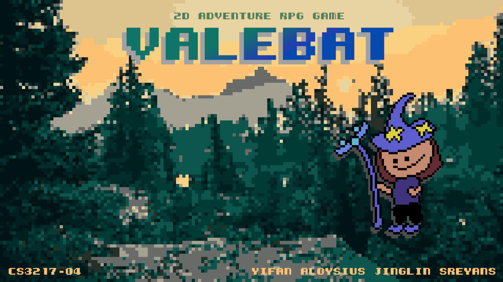
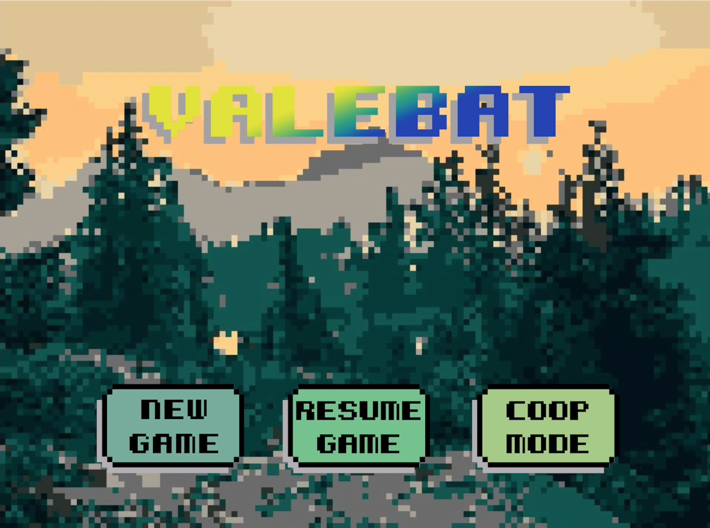

<!-- markdownlint-disable MD033 MD041 -->

<p align="center"></p>

<h1 align="center">Valebat</h1>

## Overview

Your princess got kidnapped by an evil mage! You, a wizard apprentice, have to scale a magical tower, discover spells, and level up in order to save your princess! Each playthrough is guaranteed to allow you to have a different experience!

Welcome to the world of Valebat!

Valebat is a top-down 2D fantasy RPG. Valebat is a player vs. enemy (PvE) dungeon-style game, and supports both single-player and cooperative 2-player multiplayer.

The core of Valebat is its elemental magic system, featuring type advantages, elemental combinations and other gameplay elements. Valebat also comprises features such as level-specific objectives and random map generation to make each playthrough a uniquely fun experience!

## Demo Video

<p align="center"><a href="https://youtu.be/7_ywd0Ft9_w"></img></a></p>

## Getting Started

To run this application locally, first clone this repository.

```bash
git clone https://github.com/Valebat/Valebat.git
```

Then, navigate into our XCode project directory:
```bash
cd Valebat
```

Next, run the following command in the root directory of the cloned repository:

```bash
pod install
```

Finally, open the `Valebat.xcworkspace` file to view the project. You will need to change the development team and bundle identifier accordingly to be able to build it locally.

## User Guide

Please refer to our user guide [here](https://tinyurl.com/ValebatUG). 

## Developer Guide

Please refer to our developer guide [here](https://tinyurl.com/ValebatDG).
